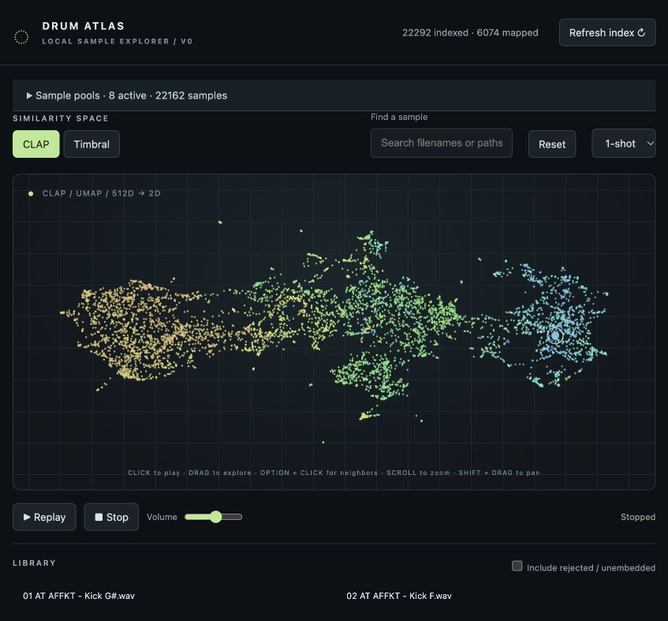
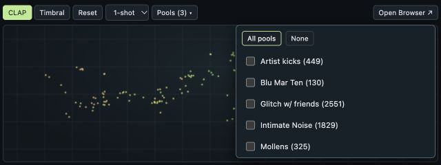

# Drum Atlas

**Explore your drum samples by sound.**

Drum Atlas turns your sample folders into an interactive map: nearby sounds share similar characteristics, making it easy to discover a kick, find a different snare, or stumble onto something unexpected. Use it in your browser or directly inside Ableton Live with the included Max for Live device.

## Explore, collect, play

- **Browse by similarity.** Switch between CLAP and Timbral maps, click to audition, or drag across sounds. Option-click to find similar samples.
- **Build sample pools.** Organize folders into pools and combine any selection—or select them all. Shared samples reuse their existing analysis.
- **Zoom into a collection.** Choose **Embed selection** to make a map of your active pools, then **Global embed** to return to the full library layout.
- **Connect to Ableton Live.** There is a compact max4live device that you can load directly in ableton. This compact device and the browser browser stay synchronized. Choose **1-shot**, **16ths**, **8ths**, or **4ths** for audition timing; synced modes follow Live’s running transport.
- **Play in Ableton Live.** The currently selected sample can be played via MIDI (use any midi note, pitch is not considered).
- **Keep your library local.** Audio stays in its original folders. Analysis runs on your Mac, and your samples are never uploaded.

## Install & get started

Currently set up for **macOS with Python 3.12**. Using the device also requires **Ableton Live with Max for Live**.

1. Download or clone this project into a permanent folder.
2. Follow the [installation guide](INSTALL-ON-ANOTHER-MAC.md), then run **Setup.command**.
3. Load the device from [`max4live/`](max4live/) in Live. Once its launch script is configured, it starts the server automatically. For browser-only use, double-click **Launch.command**, then **Open Drum Atlas.webloc**.
4. In the full browser, open **Sample pools → + New Pool** and enter a sample folder’s path. The first scan downloads the analysis model and can take a while.

**The Max for Live device can live anywhere**—including your Ableton User Library. It does not need to stay in the DrumAtlas project folder. Keep its companion script accessible to Max and set the project location as described in the [installation guide](INSTALL-ON-ANOTHER-MAC.md#max-for-live).

## Inside Live

A compact map, audition timing, and pool selection stay close to your session. **Open Browser** brings up the larger interface for managing pools and exploring your library.

*The compact web interface used inside the Max for Live device.*

## More details

- [Installation, device setup & troubleshooting](INSTALL-ON-ANOTHER-MAC.md)
- [Library, pools & API architecture](ARCHITECTURE.md)
- [Max timing messages & patch wiring](MAX-SYNC.md)

Drum Atlas is an evolving prototype. The map is a visual guide; nearest-neighbor searches compare the original sound features.
